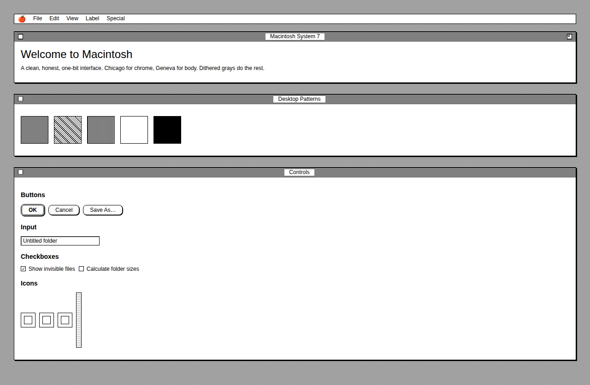
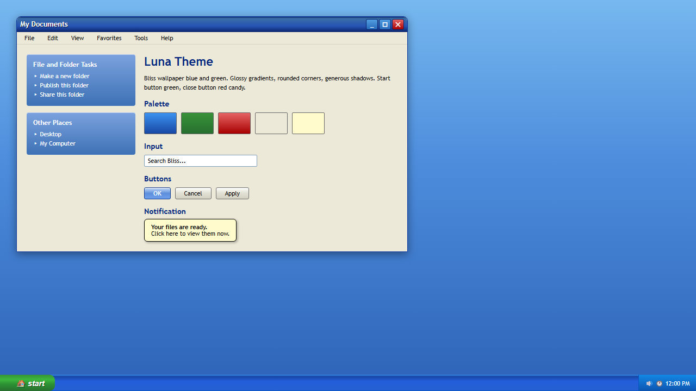
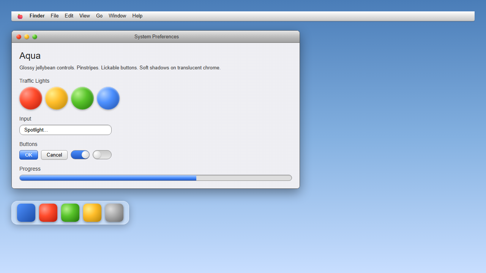
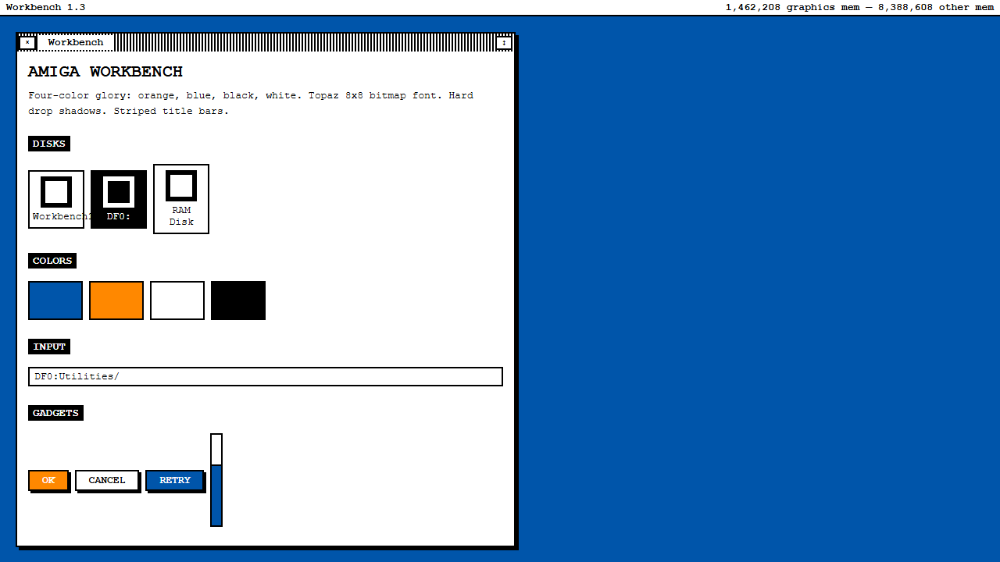

# Retro Design System

A collection of **18 self-contained retro UI design systems**, each inspired by a specific era of computing. Every system lives in its own folder and ships as a single `index.html` file with tokens, components, and a showcase layout.

## Screenshot Preview (5 examples)

| Mac System 7 | Windows 95 |
|---|---|
|  |  |

| Windows XP Luna | Mac OS X Aqua |
|---|---|
|  |  |

| Amiga Workbench |
|---|
|  |

## Included Systems

1. Mac System 7
2. Windows 95
3. Windows XP Luna
4. Mac OS X Aqua
5. Amiga Workbench
6. NeXTSTEP
7. BeOS
8. Teletext
9. CRT Phosphor
10. DOS CGA
11. 8-Bit Arcade
12. Frutiger Aero
13. Winamp Skin
14. GeoCities Web 1.0
15. Cassette Futurism
16. Vaporwave
17. Memphis
18. PS1 Tech

## Quick Start

Open any folder's `index.html` directly in a browser, or run a local static server:

```bash
python -m http.server 8000
```

Then visit `http://localhost:8000/`.

## How To Use In Your Own Project

- Pick the system you want.
- Copy its token/style section into your project CSS.
- Reuse component markup patterns from the showcase to get the full look quickly.

## Project Structure

Each numbered folder contains one standalone system:

```text
01-mac-system-7/
02-windows-95/
...
18-ps1-tech/
```

## Credits

Created by **NovusGFX**.
