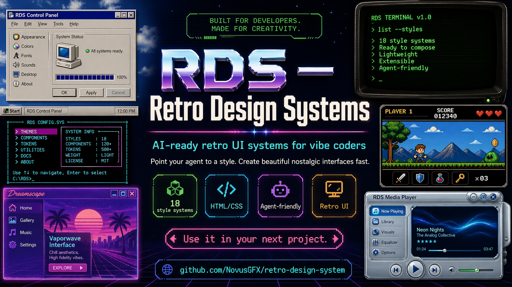
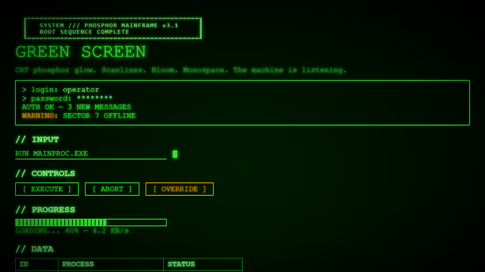
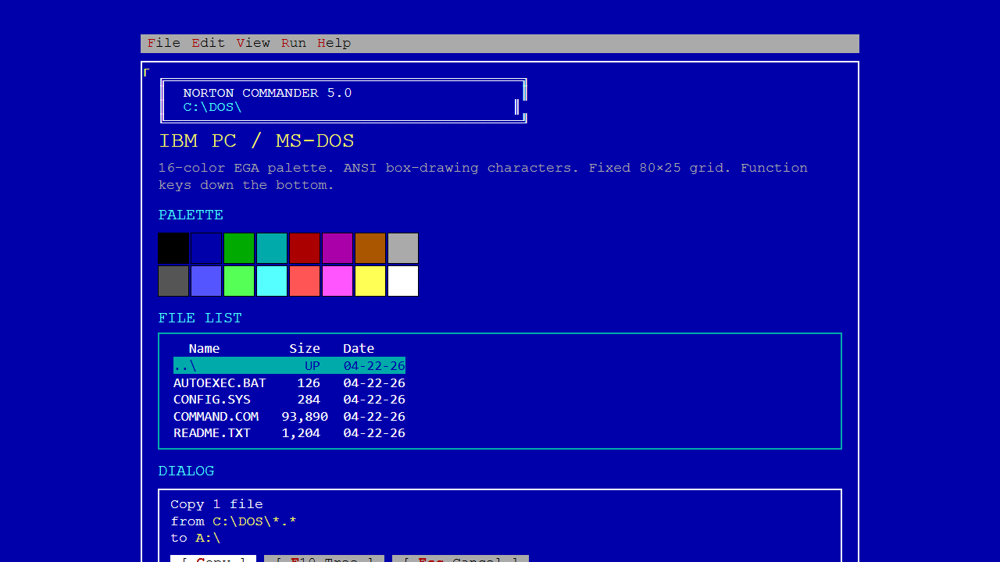
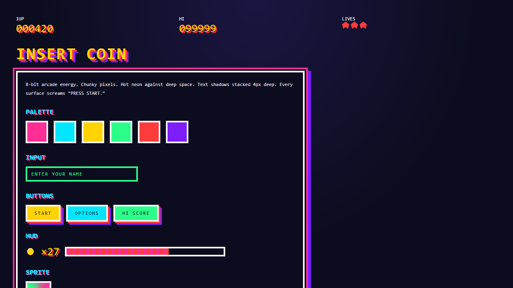
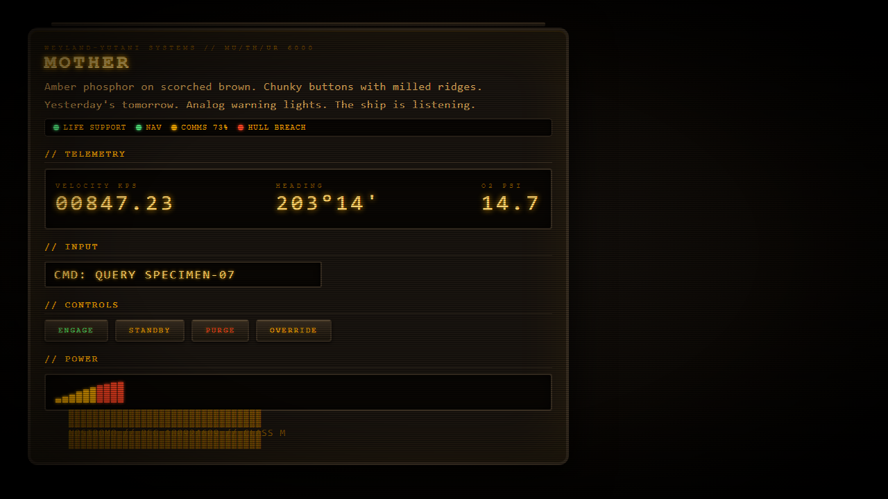

# Retro Design System



[](https://github.com/NovusGFX/retro-design-system/stargazers)
[](https://github.com/NovusGFX/retro-design-system/network/members)
[](https://github.com/NovusGFX/retro-design-system/commits/main)
[](https://github.com/NovusGFX/retro-design-system)
[](./LICENSE)

## Live Showcase

- Interactive explorer: [https://novusgfx.github.io/retro-design-system/docs/](https://novusgfx.github.io/retro-design-system/docs/)
- Source page: `docs/index.html`

Retro Design System is an **AI-ready retro UI design system library** for developers, designers, prompt engineers, and creative coders who want nostalgic interfaces with modern implementation speed. It includes 34 standalone HTML/CSS design systems inspired by iconic eras like Windows 95, CRT terminals, DOS CGA, 8-bit arcade, Aqua, Tron, Risograph print, IBM 3270 mainframes, TempleOS, BBS ANSI art, the Matrix, and cassette futurism.

Each style pack is built to be easy for humans and AI coding agents (Claude, Codex, Gemini, Cursor, and similar tools) to understand, remix, and ship. Point your agent to a style folder, generate components in that visual language, and keep consistent design tokens across prototypes and production-ready frontends.

## About

An AI-agent-friendly collection of retro-inspired web UI systems with reusable tokens, component patterns, and visual references for rapid prototyping and production styling.

Retro Design System is a ready-to-use visual playground for building nostalgic interfaces fast. It distills iconic UI eras into practical, reusable design tokens and component patterns so you can prototype, ship, or theme products without rebuilding styles from scratch.

Built for modern workflows, this library is especially useful when paired with AI coding agents (Claude, Codex, Gemini, Cursor, and similar tools): point an agent at a system, ask it to generate new UI in that visual language, and iterate quickly while keeping stylistic consistency.

If you are building creative tools, game launchers, retro dashboards, experimental websites, synthwave projects, or throwback app skins, this repo gives you a strong design baseline plus copy-paste-ready references.

## Use Cases

- **AI-generated frontend themes**: Use Claude/Codex/Gemini to generate pages and components that match a specific retro style.
- **Retro dashboard UI kits**: Build admin panels, launchers, and control rooms with vintage operating system aesthetics.
- **Game website design inspiration**: Create game landing pages, overlays, and HUD-inspired interfaces using 8-bit/CRT motifs.
- **Prompt-to-UI workflows**: Feed a style reference to an AI agent and get reusable HTML/CSS output faster.
- **Creative coding and portfolio projects**: Add nostalgia-forward visual identity to experimental web projects.
- **Design token extraction for theming**: Lift palettes, borders, shadows, and typography rules into your own component systems.

## Screenshot Preview

| Mac System 7 | Windows 95 |
|---|---|
|  |  |

| Windows XP Luna | Mac OS X Aqua |
|---|---|
|  |  |

| Amiga Workbench |
|---|
|  |

| CRT Phosphor | DOS CGA |
|---|---|
|  |  |

| 8-Bit Arcade | Cassette Futurism |
|---|---|
|  |  |

## Included Systems

1. Mac System 7
2. Windows 95
3. Windows XP Luna
4. Mac OS X Aqua
5. Amiga Workbench
6. NeXTSTEP
7. BeOS
8. Teletext
9. CRT Phosphor
10. DOS CGA
11. 8-Bit Arcade
12. Frutiger Aero
13. Winamp Skin
14. GeoCities Web 1.0
15. Cassette Futurism
16. Vaporwave
17. Memphis
18. PS1 Tech
19. OS/2 Warp
20. Mac OS 9 Platinum
21. Web 2.0 Glossy
22. Game Boy DMG
23. Braun / Dieter Rams
24. Tron Vector
25. VHS Tracking
26. Risograph
27. IBM 3270
28. NetHack ASCII
29. TempleOS
30. BBS ANSI Art
31. Midnight Commander
32. Matrix Rain
33. btop Meters
34. Commodore 64 BASIC

## Quick Start

Open any folder's `index.html` directly in a browser, or run a local static server:

```bash
python -m http.server 8000
```

Then visit `http://localhost:8000/`.

## How To Use In Your Own Project

- Pick the system you want.
- Copy its token/style section into your project CSS.
- Reuse component markup patterns from the showcase to get the full look quickly.

## Using With AI Coding Agents (Claude, Codex, Gemini, etc.)

Use any of the system folders as a visual/style reference and ask your agent to implement UI using that style's tokens and component patterns.

### Suggested workflow

1. Point the agent to a specific system folder (for example `styles/11-8bit-arcade/index.html`).
2. Ask it to extract tokens (colors, typography, spacing, shadows, borders) into reusable variables.
3. Ask it to build your target component/page in that same visual language.
4. Ask it to avoid modern defaults that break the retro look.

### Prompt template

```text
Use `<your-project-path>/styles/11-8bit-arcade/index.html` as the style reference.
Create [component/page] in this same visual language.

Requirements:
- Reuse the same color palette, type style, border treatment, and spacing rhythm
- Match button/input/window styling patterns from the reference
- Keep accessibility in mind (contrast, keyboard focus states, semantic HTML)
- Output clean, production-ready HTML/CSS (or React + CSS)
```

You can swap the reference path for any style in this repo:
- Use your own local project directory path, not a fixed drive letter.
- `styles/09-crt-phosphor`
- `styles/10-dos-cga`
- `styles/11-8bit-arcade`
- `styles/15-cassette-futurism`

## Project Structure

Each numbered folder inside `styles/` contains one standalone system:

```text
styles/
  01-mac-system-7/
  02-windows-95/
  ...
  18-ps1-tech/
  19-os2-warp/
  20-macos9-platinum/
  21-web20-glossy/
  22-gameboy-dmg/
  23-braun-rams/
  24-tron-vector/
  25-vhs-tracking/
  26-risograph/
  27-ibm-3270/
  28-nethack-ascii/
  29-templeos/
  30-bbs-ansi/
  31-midnight-commander/
  32-matrix-rain/
  33-btop-meters/
  34-c64-basic/
```

## FAQ

### Can I use this with Claude, Codex, Gemini, Cursor, or other coding assistants?
Yes. Point your assistant to one of the style folders, then ask for a component or page that matches that visual language.

### Is this good for production projects?
Yes, with refinement for your product needs. The systems are intentionally expressive and can be adapted for accessibility, responsiveness, and brand constraints.

### What tech stack does this support?
The base assets are plain HTML and CSS, so you can use them in static sites and in frameworks like React, Next.js, Vue, Svelte, and Astro.

## Credits

Created by **NovusGFX**.

## License

This project is licensed under the MIT License. See `LICENSE`.
